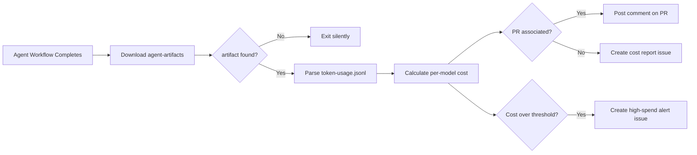

# 💰 Cost Tracker

> For an overview of all available workflows, see the [main README](../README.md).

**Automated agent cost reporter that posts a spend summary after every agent workflow run**

The [Cost Tracker workflow](../workflows/cost-tracker.md?plain=1) fires after your configured agent workflows complete, downloads the `token-usage.jsonl` data written by gh-aw's firewall, calculates per-model spend, and posts a cost breakdown on the associated pull request or creates a cost report issue.

## Installation

```bash
# Install the 'gh aw' extension
gh extension install github/gh-aw

# Add the workflow to your repository
gh aw add-wizard githubnext/agentics/cost-tracker
```

This walks you through adding the workflow to your repository.

## How It Works



The workflow reads `token-usage.jsonl` from the `agent-artifacts` artifact written by
gh-aw's firewall on every agent run. It calculates cost using a built-in per-model
pricing table and posts the result where it is most useful — the PR that triggered the
agent run, or a new issue when there is no PR.

Runs that do not produce an `agent-artifacts` artifact (non-agent CI workflows) are
skipped silently.

## Usage

### Configuration

After installing, open the workflow file and update the `workflows` list under `on.workflow_run`
to match the names of your agent workflows:

```yaml
on:
  workflow_run:
    workflows: ["agent-implement", "agent-pr-fix"]  # your workflow names here
    types:
      - completed
```

To adjust the high-spend alert threshold, find the `$1.00` value in the workflow body
and change it to your preferred limit.

After editing run `gh aw compile` to update the workflow and commit all changes to the
default branch.

### Token data source

Cost Tracker reads `sandbox/firewall/logs/api-proxy-logs/token-usage.jsonl` from the
`agent-artifacts` artifact. This file is written automatically by gh-aw's firewall on
every agent run. No additional configuration is needed to produce it — the data is
already there if you are running gh-aw with firewall enabled (the default).

## Learn More

- [token-usage.jsonl reference](https://github.github.io/gh-aw/reference/token-usage/)
- [gh-aw firewall documentation](https://github.github.io/gh-aw/reference/firewall/)
- [CI Doctor workflow](ci-doctor.md) — investigate CI failures automatically

## Going Further

Cost Tracker works standalone — no external services required. For teams that want
persistent run history, per-repo spend trends, and budget alerts across multiple repos,
add [AgentMeter](https://agentmeter.app) to your agent workflow:

```yaml
- uses: agentmeter/agentmeter-action@v1
  with:
    api-key: ${{ secrets.AGENTMETER_API_KEY }}
```

AgentMeter ingests the same token data and surfaces it in a shared dashboard with
per-repo trend charts and budget alerts.
