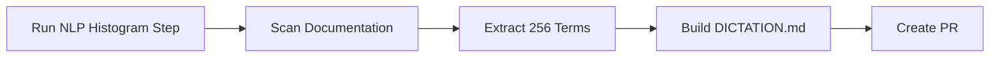

# 🎙️ Dictation Prompt Generator

> For an overview of all available workflows, see the [main README](../README.md).

**Generate and maintain a project-specific dictation instruction file for speech-to-text workflows**

The [Dictation Prompt Generator workflow](../workflows/dictation-prompt.md?plain=1) runs weekly on Sundays. It scans your documentation for technical vocabulary, builds an NLP word-frequency histogram, and creates or updates `DICTATION.md` — a concise dictation instruction file that teaches your speech-to-text engine your project's terminology.

Pairs naturally with [dictationmd](https://github.com/pelikhan/dictationmd), a tool that reads `DICTATION.md` and configures speech recognition profiles accordingly.

## Installation

```bash
# Install the 'gh aw' extension
gh extension install github/gh-aw

# Add the workflow to your repository
gh aw add-wizard githubnext/agentics/dictation-prompt
```

This walks you through adding the workflow to your repository.

## How It Works



1. **Setup step**: A shell script scans common documentation locations (`docs/`, `documentation/`, `wiki/`, `pages/`, `content/`, `site/`, and root-level markdown files) and prints a word-frequency histogram of backtick-quoted tokens and technical identifiers.
2. **Agent**: Uses the histogram output and targeted semantic searches to extract the 256 most relevant project-specific terms, then creates or updates `DICTATION.md` with:
   - A 256-term project glossary (alphabetically sorted)
   - Speech-to-text error correction guidance (ambiguous terms, spacing, hyphenation)
   - Text "agentification" rules: removing filler words and improving clarity

## Usage

The workflow runs every Sunday around 06:00 UTC. You can also trigger it manually.

### Configuration

This workflow works out of the box. You can customize the glossary size, documentation paths, and PR settings in the workflow file.

After editing run `gh aw compile` to update the workflow and commit all changes to the default branch.

### Commands

You can start a run immediately:

```bash
gh aw run dictation-prompt
```

### Triggering CI on Pull Requests

To automatically trigger CI checks on PRs created by this workflow, configure an additional repository secret `GH_AW_CI_TRIGGER_TOKEN`. See the [triggering CI documentation](https://github.github.com/gh-aw/reference/triggering-ci/) for setup instructions.

## Learn More

- [dictationmd](https://github.com/pelikhan/dictationmd) — companion tool that reads `DICTATION.md` and configures speech recognition profiles
